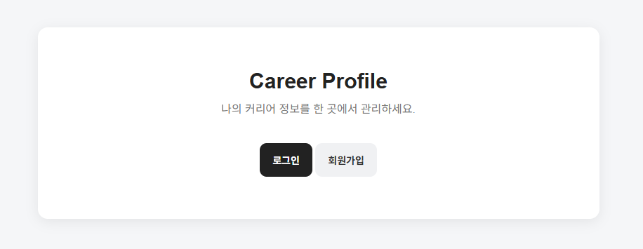
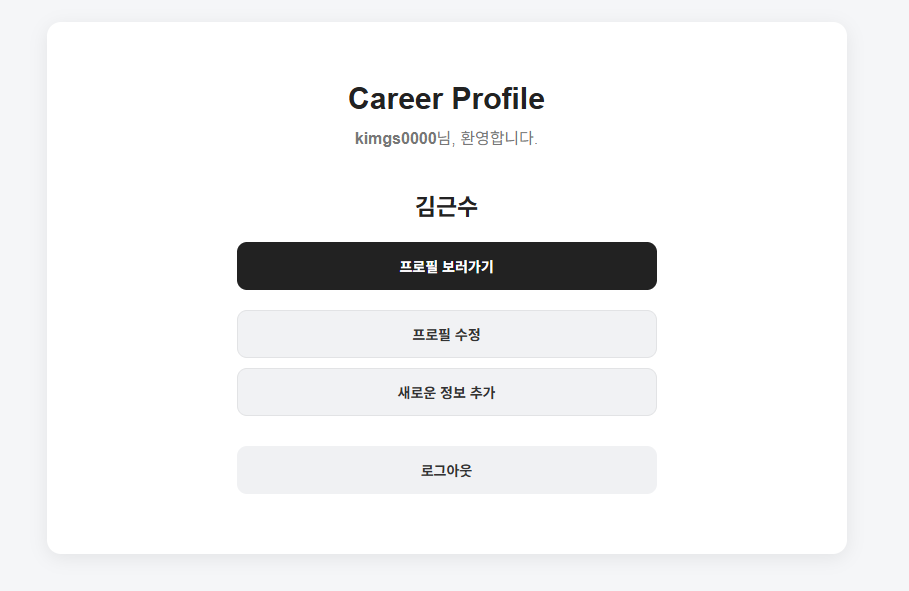
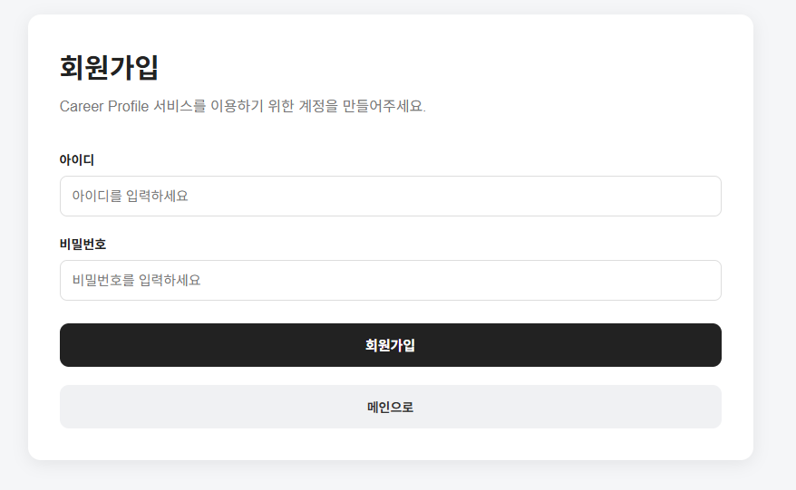
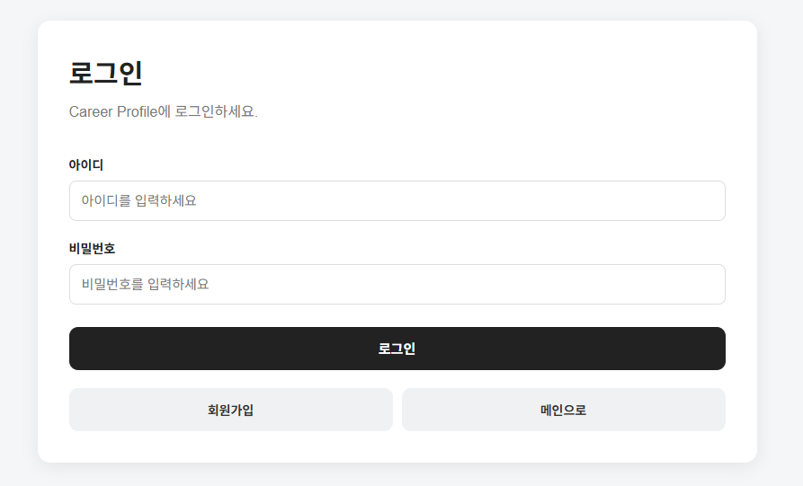
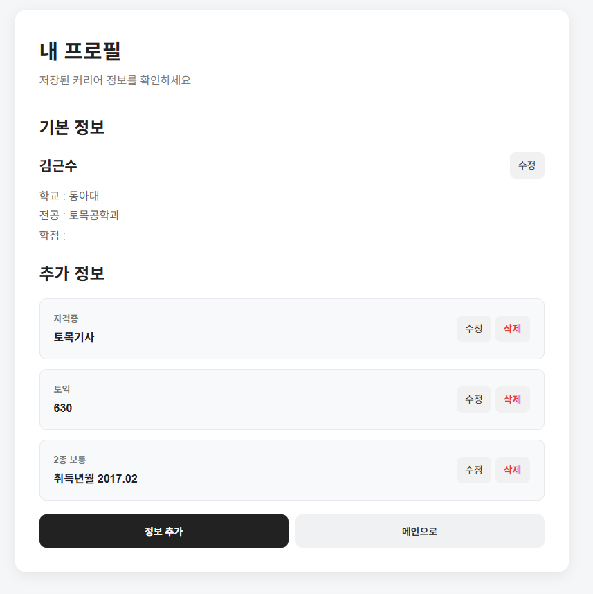

# 💼 Career Profile


🌐 **[서비스 바로가기 →](https://careerprofile-eja5.onrender.com)**


> 회원가입 및 로그인 후 개인 프로필과 커리어 정보를 등록하고 관리할 수 있는 웹 애플리케이션

Spring Boot와 JPA를 사용하여 PostgreSQL 데이터베이스와 연동하고,  
회원별로 자신의 프로필과 커리어 정보를 관리할 수 있도록 구현했습니다.

---

## 📌 프로젝트 소개

취업 준비 과정에서 개인의 학력 및 커리어 정보를 직접 등록하고 관리할 수 있는
웹 애플리케이션을 제작했습니다.

회원가입과 로그인을 통해 사용자를 구분하고,  
로그인한 사용자의 프로필과 추가 커리어 정보를 등록, 조회, 수정, 삭제할 수 있도록 구현했습니다.

### 🎯 프로젝트 목표

- Spring Boot 기반 웹 애플리케이션 개발 경험
- Spring Security를 이용한 회원 인증 구현
- Spring Data JPA를 이용한 데이터베이스 연동
- 회원별 데이터 관리 구조 이해
- CRUD 기능 구현 및 웹 페이지 구성 경험

---

## 🛠 기술 스택

### Backend


### Frontend


### Database / Build


---

## ✨ 주요 기능

### 👤 회원 관리

- 회원가입
- 로그인
- 로그아웃
- 회원별 데이터 분리

### 📄 프로필 관리

- 기본 프로필 등록
- 프로필 조회
- 프로필 수정
- 프로필 삭제

### 💼 커리어 정보 관리

- 추가 커리어 정보 등록
- 커리어 정보 조회
- 커리어 정보 수정
- 커리어 정보 삭제
- 하나의 프로필에 여러 커리어 정보 등록

---

## 🖥 화면 구성

## 🖥 화면 구성

### 🏠 메인 화면

| 메인 화면 | 메인 화면2 |
|---|---|
|  |  |

### 🔐 회원가입 / 로그인

| 회원가입 | 로그인 |
|---|---|
|  |  |

### 👤 프로필 관리

| 프로필 조회 | 프로필 수정 |
|---|---|
|  |  |

### ✏️ 프로필 수정2


---

## ⚙️ 주요 구현 내용

### 🔐 Spring Security를 이용한 로그인

Spring Security를 사용하여 회원가입 및 로그인 기능을 구현했습니다.

로그인한 사용자를 기준으로 자신의 프로필 데이터를 조회할 수 있도록 구성했습니다.

### 🗄️ JPA를 이용한 데이터베이스 연동

Spring Data JPA를 사용하여 Java 객체와 PostgreSQL 데이터베이스를 연동했습니다.

JPA Repository를 이용하여 데이터 등록, 조회, 수정, 삭제 기능을 구현했습니다.

### 👤 회원별 프로필 관리

사용자와 프로필을 연결하여 로그인한 사용자의 프로필을 구분해서 관리하도록 구현했습니다.

### 📋 추가 커리어 정보 관리

하나의 프로필에 여러 개의 추가 커리어 정보를 등록할 수 있도록 구성했습니다.

예를 들어 자격증, 경력, 프로젝트 등의 정보를 추가로 등록할 수 있습니다.

---

## 🗃️ 데이터베이스 구조

프로젝트에서는 다음 3개의 주요 테이블을 사용합니다.

```text
app_user
    │
    │ 1 : 1
    ▼
career_profile
    │
    │ 1 : N
    ▼
career_info
